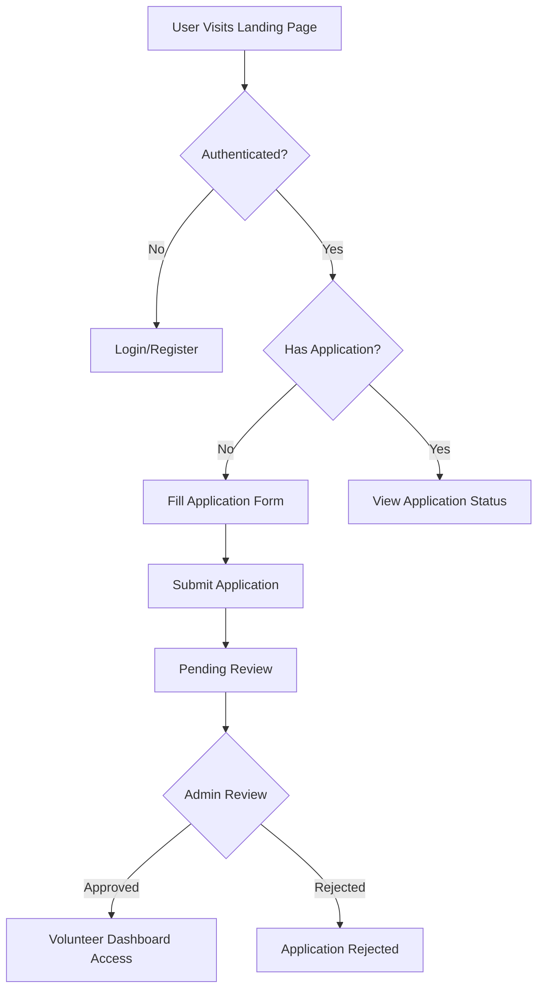
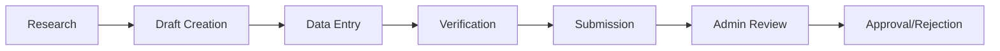

# NESA Nominee Research Corps (NRC) System Documentation

## 📋 Table of Contents
1. [System Overview](#system-overview)
2. [Architecture & Components](#architecture--components)
3. [User Roles & Permissions](#user-roles--permissions)
4. [Application Process](#application-process)
5. [Nomination Management](#nomination-management)
6. [Dashboard & Analytics](#dashboard--analytics)
7. [Data Models](#data-models)
8. [Technical Implementation](#technical-implementation)
9. [Security & Compliance](#security--compliance)
10. [Operational Workflow](#operational-workflow)

---

## 🌍 System Overview

The **NESA Nominee Research Corps (NRC)** is a comprehensive digital platform designed to power the NESA-Africa 2025 Awards by identifying, validating, and managing over 6,000+ nominees across Africa and the diaspora. The system operates as a specialized volunteer taskforce management platform with advanced research, tracking, and analytics capabilities.

### **Mission Statement**
To build a verified database of 6,000+ changemakers worthy of recognition across Africa and the diaspora, ensuring quality, credibility, and balanced representation across all award categories.

### **Core Objectives**
- **Nominee Identification**: Research and document qualified changemakers
- **Quality Assurance**: Validate achievements and impact stories
- **Global Representation**: Ensure balanced coverage across all African regions
- **Data Integrity**: Maintain accurate, verifiable nominee information
- **Volunteer Management**: Coordinate and track volunteer research activities

---

## 🏗️ Architecture & Components

### **Frontend Architecture**
```
NRC System Frontend
├── Landing Page (/get-involved/nrc-volunteer)
├── Application Form (/get-involved/nrc-volunteer/apply)
├── Volunteer Dashboard (/get-involved/nrc-volunteer/dashboard)
├── Admin Dashboard (Admin-only access)
├── Progress Tracking System
├── Notification Center
├── Export & Reporting Tools
└── Analytics & Insights
```

### **Core Components**

#### **1. Landing Page System**
- **Hero Section**: Background image with program overview
- **Program Details**: Timeline, requirements, benefits
- **Application CTA**: Dynamic button based on user status
- **Responsive Design**: Mobile-first approach with accessibility

#### **2. Application Management**
- **Multi-step Form**: Comprehensive volunteer application
- **File Upload**: CV and supporting documents
- **Validation**: Real-time form validation with Zod
- **Status Tracking**: Application status monitoring

#### **3. Volunteer Dashboard**
- **Progress Tracking**: Real-time nominee submission tracking
- **Analytics**: Performance metrics and insights
- **Nominee Management**: CRUD operations for nominees
- **Bulk Operations**: Mass export, submission, deletion
- **Search & Filter**: Advanced filtering capabilities

#### **4. Admin Dashboard**
- **Application Review**: Approve/reject volunteer applications
- **System Analytics**: Platform-wide statistics
- **Data Export**: Comprehensive reporting tools
- **User Management**: Volunteer oversight and management

---

## 👥 User Roles & Permissions

### **1. Guest Users**
- **Access**: Landing page, program information
- **Actions**: View program details, initiate application
- **Restrictions**: Cannot access dashboard or submit nominees

### **2. Applicants**
- **Access**: Application form, status checking
- **Actions**: Submit application, upload documents
- **Status**: Pending approval

### **3. Approved Volunteers**
- **Access**: Full volunteer dashboard
- **Actions**: 
  - Submit and manage nominees
  - Track progress and analytics
  - Export data
  - Access notification center
- **Target**: 200+ nominees per volunteer

### **4. Admin Users**
- **Access**: All system components
- **Actions**:
  - Review and approve applications
  - Access all volunteer data
  - Generate system-wide reports
  - Manage platform settings
- **Oversight**: Complete system administration

---

## 📝 Application Process

### **Phase 1: Registration & Application**


### **Application Requirements**
- **Personal Information**: Full name, email, phone, country
- **Motivation**: Why they want to join (minimum 50 characters)
- **Experience**: Relevant background (minimum 30 characters)
- **Availability**: Commitment confirmation
- **Skills**: Research, writing, digital tools proficiency
- **Documents**: CV upload (optional)
- **Commitments**: 
  - Complete 200+ nominee profiles
  - Participate in weekly check-ins
  - Maintain data quality standards

### **Validation Criteria**
- **Technical Skills**: Familiarity with digital tools
- **Knowledge Base**: Understanding of SDG 4, AU Agenda 2063, ESG
- **Commitment**: Available for 30-day engagement period
- **Quality**: Excellent research and writing skills

---

## 🎯 Nomination Management

### **Nominee Profile Structure**
Each nominee entry includes:
- **Basic Information**: Full name, organization, country, region
- **Contact Details**: Email, phone, website, LinkedIn
- **Award Classification**: Category, subcategory
- **Impact Documentation**: Achievement summary, metrics, beneficiaries
- **Alignment Verification**: SDG, Agenda 2063, ESG compliance
- **Supporting Evidence**: Verification links, media, documents
- **Status Tracking**: Draft, submitted, approved, rejected

### **Nomination Workflow**


### **Quality Assurance**
- **Verification Requirements**: Minimum 2 sources per nominee
- **Impact Validation**: Measurable achievements required
- **Authenticity Checks**: Cross-reference with public records
- **Alignment Verification**: SDG 4, ESG, Agenda 2063 compliance
- **Completion Scoring**: Automated quality assessment

---

## 📊 Dashboard & Analytics

### **Volunteer Dashboard Features**

#### **1. Progress Overview**
- **Target Tracking**: 200+ nominees goal
- **Completion Rate**: Percentage of target achieved
- **Quality Score**: Average completion score
- **Time Remaining**: Days until deadline

#### **2. Performance Metrics**
- **Weekly Progress**: Submissions per week
- **Category Distribution**: Nominees by award category
- **Country Coverage**: Geographic distribution
- **Status Breakdown**: Draft, submitted, approved counts

#### **3. Advanced Analytics**
- **Productivity Trends**: Performance over time
- **Quality Insights**: Completion score analysis
- **Milestone Tracking**: Achievement unlocking
- **Comparative Analysis**: Performance vs. other volunteers

#### **4. Management Tools**
- **Search & Filter**: Advanced nominee filtering
- **Bulk Operations**: Mass actions on multiple nominees
- **Export Options**: CSV, JSON, PDF formats
- **View Modes**: Grid and list layouts

### **Admin Dashboard Features**

#### **1. System Overview**
- **Total Applications**: All volunteer applications
- **Active Volunteers**: Approved and active users
- **Nominee Statistics**: Platform-wide nominee counts
- **Performance Metrics**: System-wide analytics

#### **2. Application Management**
- **Review Queue**: Pending applications
- **Approval Workflow**: Accept/reject with notes
- **Volunteer Tracking**: Monitor volunteer performance
- **Communication Tools**: Notification system

#### **3. Data Analytics**
- **Regional Distribution**: Coverage by country/region
- **Category Analysis**: Nominees by award type
- **Quality Metrics**: Platform-wide quality scores
- **Export Capabilities**: Comprehensive reporting

---

## 🗄️ Data Models

### **NRCApplication Interface**
```typescript
interface NRCApplication {
  id: string;
  fullName: string;
  email: string;
  phone: string;
  country: string;
  motivation: string;
  experience: string;
  availability: string;
  skills: string[];
  commitment: boolean;
  terms: boolean;
  cv?: File;
  applicationDate: string;
  status: 'pending' | 'approved' | 'rejected';
  reviewedBy?: string;
  reviewDate?: string;
  reviewNotes?: string;
}
```

### **NRCVolunteer Interface**
```typescript
interface NRCVolunteer {
  id: string;
  applicationId: string;
  fullName: string;
  email: string;
  country: string;
  approvalDate: string;
  targetNominees: number;
  assignedRegions?: string[];
  assignedCategories?: string[];
  status: 'active' | 'inactive' | 'suspended';
}
```

### **NomineeProfile Interface**
```typescript
interface NomineeProfile {
  id: string;
  volunteerId: string;
  fullName: string;
  organizationName?: string;
  country: string;
  region: string;
  email?: string;
  phone?: string;
  website?: string;
  linkedinProfile?: string;
  awardCategory: string;
  subcategory: string;
  achievementSummary: string;
  impactMetrics: string;
  beneficiariesCount?: string;
  yearsOfImpact?: string;
  sdgAlignment: string[];
  agendaAlignment: string;
  esgAlignment: string;
  verificationLinks?: string;
  mediaLinks?: string;
  additionalNotes?: string;
  supportingDocuments?: File[];
  profileImage?: File;
  status: 'draft' | 'submitted' | 'approved' | 'rejected';
  dateCreated: string;
  completionScore: number;
}
```

---

## ⚙️ Technical Implementation

### **Frontend Stack**
- **Framework**: Next.js 14 with TypeScript
- **Styling**: Tailwind CSS with custom components
- **State Management**: React Context + Custom hooks
- **Animations**: Framer Motion
- **Forms**: React Hook Form + Zod validation
- **Icons**: Lucide React
- **Data Storage**: localStorage (mock backend)

### **Key Services**

#### **1. mockNRCService.ts**
- **Application Management**: Submit, review, approve applications
- **Volunteer Management**: Track volunteer status and performance
- **Nominee Management**: CRUD operations for nominees
- **Data Persistence**: localStorage-based mock backend

#### **2. mockNotificationService.ts**
- **Real-time Notifications**: Application status updates
- **Notification Types**: Application, nominee, system, reminder
- **Preference Management**: User notification settings
- **Delivery System**: In-app notification center

#### **3. progressTrackingService.ts**
- **Milestone Tracking**: Achievement system
- **Performance Analytics**: Detailed metrics calculation
- **Progress Insights**: Trend analysis and projections
- **Gamification**: Badge and achievement system

#### **4. exportService.ts**
- **Data Export**: Multiple format support (CSV, JSON, PDF)
- **Report Generation**: Comprehensive analytics reports
- **Bulk Operations**: Mass data processing
- **File Management**: Download and sharing capabilities

### **Custom Hooks**

#### **useNRCStatus**
- **Purpose**: Track user's NRC application and volunteer status
- **Features**: Real-time status checking, dashboard access control
- **Integration**: Used across all NRC components

#### **useNotifications**
- **Purpose**: Manage in-app notifications
- **Features**: Real-time updates, preference management
- **Integration**: Notification center and bell component

---

## 🔒 Security & Compliance

### **Data Protection**
- **Local Storage**: Secure client-side data persistence
- **Input Validation**: Comprehensive form validation with Zod
- **File Upload**: Secure file handling and validation
- **Access Control**: Role-based permission system

### **Privacy Compliance**
- **Data Minimization**: Collect only necessary information
- **User Consent**: Clear terms and conditions
- **Data Retention**: Defined storage periods
- **Export Rights**: User data export capabilities

### **Quality Assurance**
- **Verification Requirements**: Multi-source validation
- **Authenticity Checks**: Cross-reference verification
- **Impact Validation**: Measurable achievement requirements
- **Ethical Guidelines**: Non-contact policy with nominees

---

## 🔄 Operational Workflow

### **Timeline Overview**
```
Phase 1: Preparation (July 15-20, 2025)
├── Volunteer recruitment and onboarding
├── Platform training and orientation
├── Tool setup and access provisioning
└── Initial briefing sessions

Phase 2: Research Phase (July 20 - August 20, 2025)
├── Active nominee research and documentation
├── Weekly progress tracking and check-ins
├── Quality assurance and validation
└── Milestone achievement and recognition

Phase 3: Validation Phase (August 10-25, 2025)
├── Admin review and approval process
├── Data quality verification
├── Final nominee database compilation
└── Handover to judging committees

Phase 4: Public Phase (August 10 - November 1, 2025)
├── Public nomination portal opening
├── Ongoing validation of public submissions
├── Integration with voting systems
└── Final database preparation
```

### **Weekly Operations**
- **Monday**: Progress review and target setting
- **Wednesday**: Mid-week check-in and support
- **Friday**: Weekly submission and quality review
- **Ongoing**: Real-time support and communication

### **Quality Metrics**
- **Target**: 200+ nominees per volunteer
- **Quality Score**: Minimum 80% completion rate
- **Verification**: 2+ sources per nominee
- **Timeline**: 30-day completion window

---

## 📈 Success Metrics

### **Quantitative Targets**
- **Total Nominees**: 6,000+ verified profiles
- **Volunteer Count**: 30 active researchers
- **Geographic Coverage**: All 54 African countries + diaspora
- **Category Coverage**: 1,000+ subcategories
- **Quality Standard**: 80%+ completion scores

### **Qualitative Goals**
- **Representation**: Balanced gender, regional, sectoral coverage
- **Impact**: Meaningful changemaker identification
- **Authenticity**: Verified, credible nominee profiles
- **Accessibility**: Inclusive nomination process
- **Recognition**: Dignified presentation of African excellence

---

## 🛠️ Development & Deployment

### **Development Setup**
```bash
# Clone repository
git clone [repository-url]
cd nesa-frontend

# Install dependencies
npm install

# Start development server
npm run dev

# Build for production
npm run build
```

### **Environment Configuration**
```env
NEXT_PUBLIC_API_URL=your_api_url
NEXT_PUBLIC_APP_URL=your_app_url
NEXTAUTH_SECRET=your_nextauth_secret
NEXTAUTH_URL=your_nextauth_url
```

### **File Structure**
```
src/
├── components/UI/nrc/
│   ├── NRCLandingPage.tsx
│   ├── NRCApplicationForm.tsx
│   ├── NRCDashboard.tsx
│   ├── NotificationCenter.tsx
│   ├── ProgressTrackingDashboard.tsx
│   ├── ReportingDashboard.tsx
│   └── ExportCenter.tsx
├── lib/
│   ├── services/
│   │   ├── mockNRCService.ts
│   │   ├── mockNotificationService.ts
│   │   ├── progressTrackingService.ts
│   │   └── exportService.ts
│   ├── hooks/
│   │   ├── useNRCStatus.ts
│   │   └── useNotifications.ts
│   └── context/
│       └── AuthContext.tsx
├── styles/
│   ├── nrc-hero.css
│   └── accessibility.css
└── docs/
    ├── NRC-System-Documentation.md
    └── nrc-hero-enhancement.md
```

### **Testing Strategy**
```bash
# Run unit tests
npm run test

# Run integration tests
npm run test:integration

# Run accessibility tests
npm run test:a11y

# Run performance tests
npm run test:performance
```

---

## 📞 Support & Maintenance

### **Technical Support**
- **Development Team**: Frontend development and bug fixes
- **System Admin**: Platform maintenance and monitoring
- **User Support**: Volunteer assistance and training

### **Monitoring & Analytics**
- **Performance Monitoring**: Core Web Vitals tracking
- **Error Tracking**: Real-time error monitoring
- **User Analytics**: Usage patterns and engagement metrics
- **System Health**: Platform availability and performance

### **Backup & Recovery**
- **Data Backup**: Regular localStorage backup procedures
- **System Recovery**: Disaster recovery protocols
- **Version Control**: Git-based code versioning
- **Rollback Procedures**: Safe deployment rollback strategies

---

## 🔮 Future Enhancements

### **Phase 2 Features**
- **Real Backend Integration**: Replace localStorage with actual API
- **Advanced Analytics**: Machine learning insights
- **Mobile Application**: Native mobile app development
- **Offline Capabilities**: Progressive Web App features

### **Scalability Improvements**
- **Database Optimization**: Enhanced data storage solutions
- **Performance Optimization**: Advanced caching strategies
- **Load Balancing**: Distributed system architecture
- **API Rate Limiting**: Enhanced security measures

### **User Experience Enhancements**
- **AI-Powered Search**: Intelligent nominee discovery
- **Automated Validation**: AI-assisted quality checking
- **Real-time Collaboration**: Multi-user editing capabilities
- **Advanced Reporting**: Custom dashboard creation

---

This comprehensive documentation provides a complete overview of the NRC system's functionality, architecture, and operational procedures. The system represents a sophisticated volunteer management and research platform designed to power Africa's most prestigious education awards.
